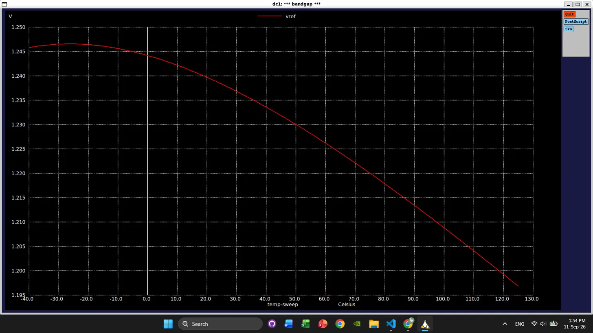

# SKY130 Bandgap Reference Experiments

Small [ngspice](https://ngspice.sourceforge.io/) simulations using the
SkyWater SKY130A device models. The repository builds up the temperature
behavior needed for a simple bandgap reference, then simulates the reference
itself.

## Requirements

- ngspice 45.2
- A SKY130A PDK checkout with `PDK_ROOT` set

The netlists load the typical-corner model file from:

```text
$PDK_ROOT/sky130A/libs.tech/ngspice/sky130.lib.spice
```

For example:

```sh
export PDK_ROOT=/path/to/your/pdk
```

## Directory layout

| Path | Description |
| --- | --- |
| `Bjt/pnp.spice` | Sweeps a PNP transistor from -40 °C to 125 °C and records $V_{BE}$ at 50 µA. |
| `Bjt/vbe.txt` | Recorded PNP $V_{BE}$ sweep data. |
| `PmosId/pmos.spice` | Evaluates a SKY130 PFET operating point at -40 °C and prints drain current and threshold voltage. |
| `PmosVth/pmos.spice` | Sweeps PFET threshold voltage from -45 °C to 125 °C. |
| `PmosVth/pmos_vth_temp.csv` | CSV output generated by the PFET threshold-voltage sweep. |
| `Bandgap/bandgap.spice` | Simulates a simple 1.8 V bandgap reference across -40 °C to 125 °C and plots `vref`. |
| `Bandgap/res.png` | Plot of the simulated bandgap reference voltage versus temperature. |

## Running the simulations

Run each netlist from the repository root in batch mode:

```sh
ngspice -b Bjt/pnp.spice
ngspice -b PmosId/pmos.spice
ngspice -b PmosVth/pmos.spice
ngspice -b Bandgap/bandgap.spice
```

The BJT and PMOS threshold simulations write their results to `Bjt/vbe.txt`
and `PmosVth/pmos_vth_temp.csv`, respectively. These files are overwritten by
the control blocks when the simulations run.

For interactive plotting of the bandgap output, start ngspice without batch
mode:

```sh
ngspice Bandgap/bandgap.spice
```

The bandgap netlist uses an ideal voltage-controlled op amp and SKY130 PFET
and PNP devices. It is intended as a compact circuit experiment rather than a
production-ready reference design; device sizing, loop stability, startup,
line regulation, and load behavior are not fully characterized.

## Bandgap result

The simulated reference voltage is approximately 1.246 V near -25 °C and
decreases to approximately 1.197 V at 125 °C. The result is shown below:


